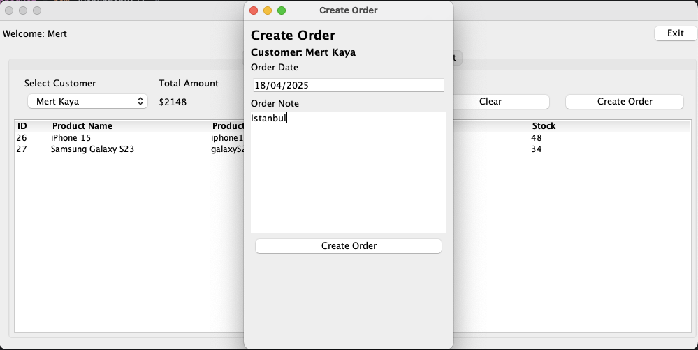

# 🛒 Order Management System

A simple desktop-based order management system built with Java Swing and MySQL.

## 🚀 Features
- **User Login:** Secure login screen with email and password validation.
- **Customer Management:**
  - Add, update, and delete customers
  - Search and filter customers by name or type
- **Product Management:**
  - Add, update, and delete products
  - Track product stock levels
  - Filter products by name, code, or stock status
- **Basket System:**
  - Add products to a temporary basket before placing an order.
- **Order Creation:**
  - Place orders for customers using selected products.
- **Validations:**
  - All input fields are validated (e.g., email format, empty fields).
- **Popup Menus:**
  - Right-click context menus for update/delete actions.

## 🧱 Technologies Used
- **Java (Swing):** Desktop UI development
- **MySQL:** Relational database
- **JDBC:** Java Database Connectivity
- **MVC Architecture:** Separation of concerns
- **DAO Pattern:** Abstracted database access
- **Singleton Pattern:** Ensures a single instance of DB connection

## 🖼️ Screenshots
> Login Frame

  

> Customer Frame

   
  

 

> Product Frame

   
  

 

> Basket Frame

   
  

 

> Cart Frame

  

